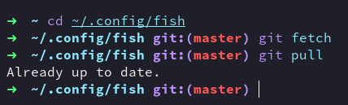
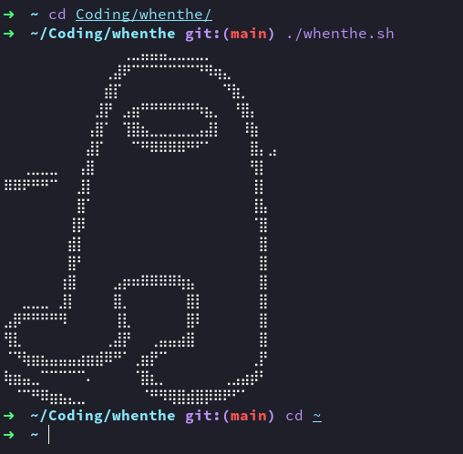
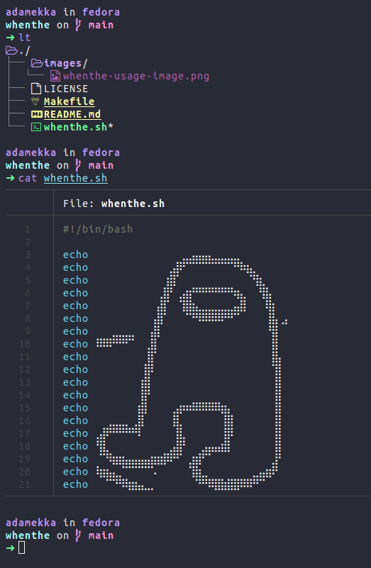

# fish

The sexiest Fish config

## Features

- [x] A lot of handy aliases
- [x] Autojump
- [x] <a style="color:red">C</a><a style="color:orange">o</a><a style="color:yellow">l</a><a style="color:green">o</a><a style="color:teal">r</a><a style="color:blue">f</a><a style="color:purple">u</a><a style="color:violet">l</a>
- [x] Sexy looking ls
- [x] Sexy looking prompt

## Install

NOTE: Your old fish config will be placed in `~/.config/fish_bak/`

```bash
mv ~/.config/fish/ ~/.config/fish_bak/ # Make a backup of your old config
git clone https://github.com/Adamekka/fish ~/.config/fish # Clone this repo to fish config folder
```

## Update

```bash
fish_update
```

If this doesn't work, do it the old way:



## Examples




