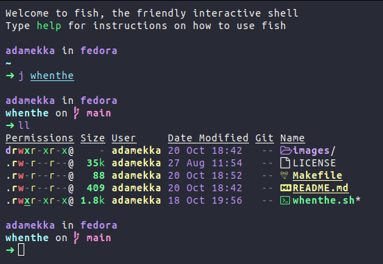

# fish

My fish config

## Install

NOTE: Your old fish config will be placed in `~/.config/fish_bak/`

```bash
mv ~/.config/fish/ ~/.config/fish_bak/ # Make a backup of your old config
git clone https://github.com/Adamekka/fish ~/.config/fish # Clone this repo to fish config folder
```

## Update

```bash
fish_update
```

If this doesn't work, do it the old way:


## Examples


